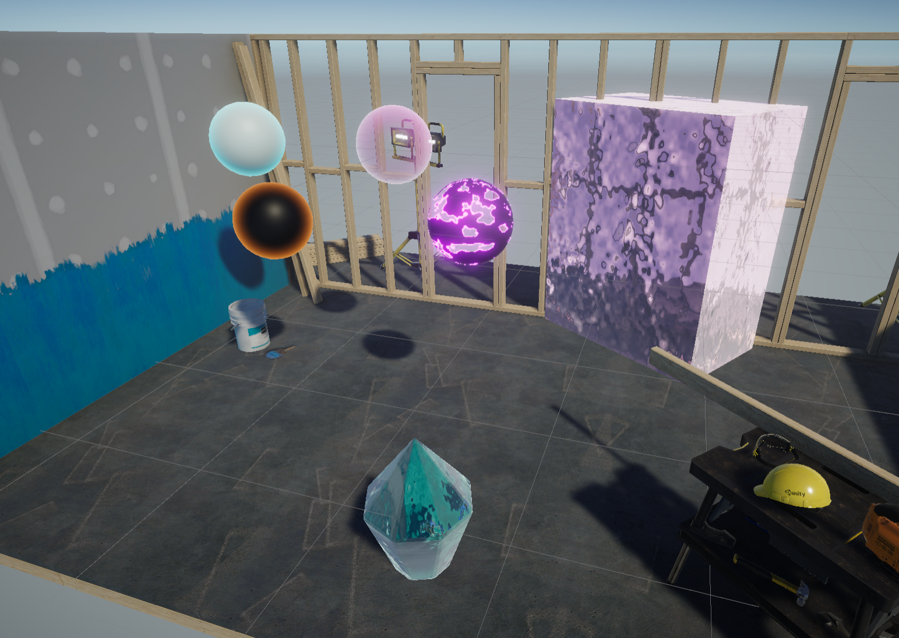

# Holberton School Unity Projects

This repository is a collection of the various projects to develop my skills in the Unity game engine,
for Holberton School's AR/VR Specilization

  * #0x00. Unity - User Interface

    Quiz answers for questions about the basics of Unity's interface

  * #0x01. Unity - Unity Concepts
 
    A dead simple project for the basics of Unity's gameobjects and more.
    
    
  * #0x04. Unity - Publishing
 
    A project to learn about publishing to multiple platforms using my marble maze project.
    
    
  * #0x05. Unity - Assets: Models, Textures
 
    The start to a series of projects creatings simple 3D platformer game, setting up models and orther assets
    
    
  * #0x06. Unity - Assets: UI
 
    The second project of the 3D platformer series, setting up visually appealing UI and menus
    
    
  * #0x07. Unity - Animation
 
    The third project of the 3D platformer series, where a character with several animations is added.
    
    
  * #0x08. Unity - Audio
 
    The final platformer project, audio is added to the environment, background music, and player to complete this small game.
    
    
  * #0x09. Unity - AR Business Card
 
    A project where I learned the basics of Vuforia Engine to create an augmented reality business card.
    
  
  * #0x0C. Unity - AR Slingshot Game
 
    An augmented reality game made using AR foundation where you destroy target chickens running around your room.
    
    
  * #0x0D. Unity - Shadergraph
 
    A collection of shaders I created to learn shader graph, which will be put into a package.
 
